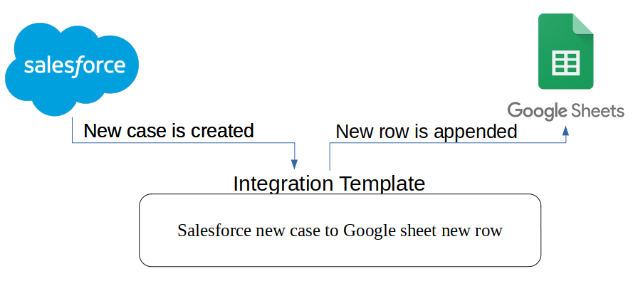

# Template: Salesforce new case to Google Sheet new row
When a new case in Salesforce is created, creates new row in Google Sheets  <br>

This integration template helps to create a spreadsheet for each new cases in salesforce. There is a listner in the 
template. It listen the changes happens for a case record in salesforce. If there is a new case
 created in the salesforce then this template fetch all data of that case record and create a spreadsheet with the case information.  



## What you need

- [Ballerina Distribution](https://ballerina.io/learn/getting-started/)
- A Text Editor or an IDE ([VSCode](https://marketplace.visualstudio.com/items?itemName=ballerina.ballerina), 
[IntelliJ IDEA](https://plugins.jetbrains.com/plugin/9520-ballerina)).  
- [Salesforce Connector](https://github.com/ballerina-platform/module-ballerinax-sfdc) and [GSheet Connector](https://github.com/ballerina-platform/module-ballerinax-googleapis.sheets) will be downloaded from 
[Ballerina Central](https://central.ballerina.io/) when running the Ballerina file.

## How to set up

Let's first see how to add the Salesforce configurations for the application.

### Setup Salesforce configurations
Create a Salesforce account and create a connected app by visiting [Salesforce](https://www.salesforce.com). 
Obtain the following parameters:

* Base URL (Endpoint)
* Client Id
* Client Secret
* Refresh Token
* Refresh URL

For more information on obtaining OAuth2 credentials, visit 
[Salesforce help documentation](https://help.salesforce.com/articleView?id=remoteaccess_authenticate_overview.htm) 
or follow the 
[Setup tutorial](https://medium.com/@bpmmendis94/obtain-access-refresh-tokens-from-salesforce-rest-api-a324fe4ccd9b).

Also, keep a note of your Salesforce username, password and the security token that will be needed for initializing the listener. 

For more information on the secret token, please visit [Reset Your Security Token](https://help.salesforce.com/articleView?id=user_security_token.htm&type=5).

[Select Objects](https://developer.salesforce.com/docs/atlas.en-us.change_data_capture.meta/change_data_capture/cdc_select_objects.htm) for Change Notifications in the User Interface of Salesforce account.

Now let's see how to add Google Sheet configurations
### Setup Google Sheet configurations
Create a Google account and create a connected app by visiting [Google cloud platform APIs and Services](https://console.cloud.google.com/apis/dashboard). 

1. Click `Library` from the left side menu.
2. In the search bar enter Google Sheets.
3. Then select `Google Sheets API` and click `Enable` button.
4. Complete OAuth Consent Screen setup (Add required mais as a test user ).
5. Click Credential tab from left side bar. In the displaying window click Create Credentials button
Select OAuth client Id.
6. Fill the required field. (Add https://developers.google.com/oauthplayground/ to the Redirect URI field if you want to use [OAuth 2.0 Playground.](https://developers.google.com/oauthplayground/) for accesstoken generation).
7. You can get credentials using `Credentials` tab in left side bar. 
8. Generate access token and refresh token using these credentials ( You can use [OAuth 2.0 Playground.](https://developers.google.com/oauthplayground/) to generate them.)

Get more details about createing OAuth 2.0 client credentials,  [visit here](https://developers.google.com/sheets/api/guides/authorizing)

Obtain the following parameters:

* Client Id
* Client Secret
* Refresh Token
* Refresh URL

## Configuring the Integration Template

Once you obtained all configurations, Replace "" in the `Config.toml` file with your data.

#### Config.conf
``` 
[<ORG_Name>.sfdc_new_case_to_gsheet]
sfdcBaseURL = "<Salesforce Base URL>"
sfdcUsername = "<Salesforce Username>"
sfdcPassword = "<Salesforce Password>"
spreadsheetId = "<SpreadSheet ID>"
worksheetName = "Worksheet name"
sfdcClientId = "<Client Id>"
sfdcClientSecret = "<Client Secrets>"
sfdcRefreshToken = "<Refresh Token>"

[<ORG_Name>.sfdc_new_case_to_gsheet.sheetOAuthConfig]
clientId = "<Sheet client Id>"
clientSecret = "<Sheet client secret>"
refreshUrl = "<Sheet refresh URL>"
refreshToken = ""<Sheet refresh token>""

```
## Running the Template

1. First you need to build the integration template and create the executable binary. Run the following command from the root directory of the integration template. 
`$ bal build`. 

2. Then you can run the integration binary with the following command. 
`$ bal run target/bin/sfdc_new_case_to_gsheet.jar`. 


Once you run, successful listener startup will print following in the console.
```
>>>>
[2021-01-27 13:02:32.879] Success:[/meta/handshake]
{ext={replay=true, payload.format=true}, minimumVersion=1.0, clientId=2qw18mvbp4r5o16025e384re8hk7, supportedConnectionTypes=[Ljava.lang.Object;@7dd62bd0, channel=/meta/handshake, id=1, version=1.0, successful=true}
<<<<
>>>>
[2021-01-27 13:02:33.040] Success:[/meta/connect]
{clientId=2qw18mvbp4r5o16025e384re8hk7, advice={reconnect=retry, interval=0, timeout=110000}, channel=/meta/connect, id=2, successful=true}
<<<<
```

3. Now you can create a new Salesforce Case and observe that integration template runtime has received the event notification for the created Salesforce Case.

4. Also you can check the Google drive , there will be a new row with case information. 
