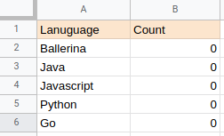

# Template: Twilio Data to a Google Sheet
When new SMS is received to a Twilio account, update a cell in a Google Sheet.

There are day-to-day scenarios where we come across surveys or competitions which are initiated with the use of SMS voting. This integration template allows you to start such kind of scenario instantly and obtain the voting results with the use of a Google Sheet. It listens to the incoming Twilio SMS (with a predefined template) and increments a count in a Google Sheet. This can be used to update specific data in the Google Sheet.<br>

The practical use case we have implemented here is a scenario where `A survey to find out the best language for building microservices out of a set of given languages`.
The users have to send an SMS in the predefined format `Vote <Language Name>` to a given Twilio number. The template will update the count on each valid SMS receive.

## Use this template to
- Get the summary of a competition/survey initiated using Twilio SMS.

## What you need
- A Twilio Account
- A Google Cloud Platform Account

## How to set up
- Import the template.
- Allow access to Twilio account.
- Provide account AUTH_TOKEN
- Allow access to the Google account.
- Select spreadsheet.
- Select worksheet.
- Get the work sheet name and populate the spreadsheet with basic data.
- Set up the template. 

# Developer Guide
<p align="center">

</p>

## Supported Versions
<table>
  <tr>
   <td>Ballerina Language Version
   </td>
   <td>Swan Lake Alpha5
   </td>
  </tr>
  <tr>
   <td>Java Development Kit (JDK)
   </td>
   <td>11
   </td>
  </tr>
  <tr>
   <td>Twilio REST API Version
   </td>
   <td>2010-04-01
   </td>
  </tr>
  <tr>
   <td>Google Sheets API Version
   </td>
   <td>V4
   </td>
  </tr>
</table>

## Pre-requisites
* Download and install [Ballerina](https://ballerinalang.org/downloads/).
* Google Cloud Platform account
* Twilio account.

## Account Configuration
### Configuration steps for Twilio account
1. From the created Twilio account, obtain the `Account SID`.
2. For setting up a callback URL in  Twilio, you can install [ngrok](https://ngrok.com/docs) and expose a local web server to 
the internet.
3. Then start the `ngork` with `twilioListener:Listener` service port (8090 in this case) by using the command `./ngrok http 8090`
4. Set the callback URL in Twilio account according to the given format. 
```
<public_url_obtained_by_ngrok>/onChange
```
(eg: https://ea0834f44458.ngrok.io/onChange) 

<div></div>

5. Use the above obtained values to set twilio_authToken and twilio_callbackUrl in the 
config(Config.toml) file.

### Configuration steps for Google Sheets account
Create a Google account and create a connected app by visiting [Google cloud platform APIs and Services](https://console.cloud.google.com/apis/dashboard). 

1. Click `Library` from the left side bar.
2. In the search bar enter Google Sheets.
3. Then select Google Sheets API and click Enable button.
4. Complete OAuth Consent Screen setup.
5. Click `Credential` tab from left side bar. In the displaying window click `Create Credentials` button
Select OAuth client Id.
6. Fill the required field. Add https://developers.google.com/oauthplayground to the Redirect URI field.
7. Get client ID and client secret. Put it on the config(Config.toml) file.
8. Visit https://developers.google.com/oauthplayground/ 
    Go to settings (Top right corner) -> Tick 'Use your own OAuth credentials' and insert Oauth client ID and client secret. 
    Click close.
9. Then,Complete step 1 (Select and Authorize APIs)
10. Make sure you select https://www.googleapis.com/auth/drive & https://www.googleapis.com/auth/spreadsheets Oauth scopes.
11. Click `Authorize APIs` and You will be in step 2.
12. Exchange Auth code for tokens.
13. Copy `access token` and `refresh token`. Put it on the config(Config.toml) file.


## Template Configuration
1. Create new spreadsheet.
2. Rename the sheet if you want.
3. Get the ID of the spreadsheet.  

5. Get the work sheet name and populate the spreadsheet with basic data. <br>Snapshot of an initial spreadsheet 
populated with basic data and ready for receiving user votes.
    <div></div>

6. Once you obtained all configurations, Create `Config.toml` in root directory.
7. Replace the necessary fields in the `Config.toml` file with your data.

### Config.toml 
```
[<ORG_NAME>.twilio_sms_to_gsheet]
twilioAuthToken = "<TWILIO_AUTH_TOKEN>"  
callbackUrl = "<CALLBACK_URL>"
spreadsheetId = "<SPREADSHEET_ID>"  
workSheetName ="<WORKSHEET_NAME>" 

[<ORG_NAME>.twilio_sms_to_gsheet.sheetOauthConfig]
clientId = "<CLIENT_ID>"  
clientSecret = "<CLIENT_SECRET>"
refreshUrl = "https://www.googleapis.com/oauth2/v3/token"
refreshToken = "<REFRESH_TOKEN>"   
```

## Running the Template
1. First you need to build the integration template and create the executable binary. Run the following command from the 
root directory of the integration template. 
`$ bal build`. 

2. Then you can run the integration binary with the following command. 
`$  bal run target/bin/twilio_to_gsheet-0.1.0.jar`. 

3. Now you can send new messages in the format `Vote <LANGUAGE_NAME>` to the specific Twilio account and observe that 
integration template runtime has received the event notification upon receiving new message.

4. You can check the Google Sheet to verify that how the count of each language is increased in the specified sheet.
 