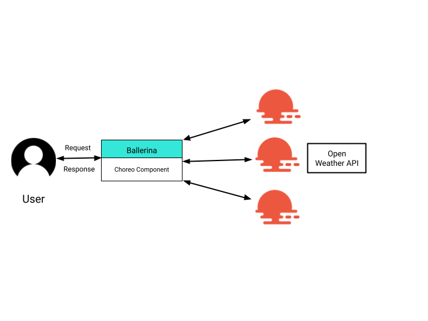

# Scatter Gather Messaging
## Use case
To understand how you can build scatter-gather messaging using Ballerina, let's consider gathering temperature data for a list of locations. This package includes a scatter-gather component to get weather data from Open Weather API for three cities. Therefore, the component requires communicating with other necessary back-ends. For the demonstration service, the component sends three requests to the Open Weather API parallel using ballerina `future`. then it waits for the each response and when the responses come, it prepares the response message to the user by gathering the separate response details. The following diagram illustrates this use case clearly.



## Prerequisites
* [Open Weather Account](https://openweathermap.org/api)

### Setting up open weather account

1. The connector initialization requires setting the API credentials. Please create an account at https://openweathermap.org and an API key following [this guide](https://openweathermap.org/appid).


## Template Configuration
Create a file called `Config.toml` at the root of the project.

### Config.toml
```
[<ORG_NAME>.scatter_gather_messaging]
apiKey : <API KEY OPEN WEATHER ACCOUNT>

```

## Testing
Run the Ballerina project created by the integration sample by executing `bal run` from the root.
